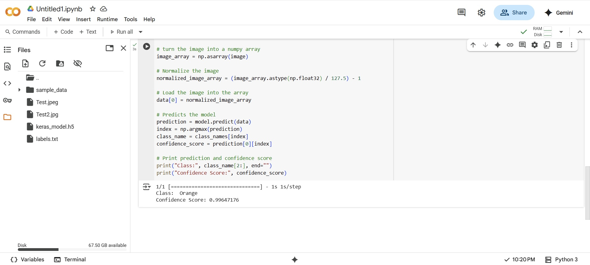

# Teachable-Machine-Image-Classifier
An image classification project using Teachable Machine and Google Colab. 
The model is trained on at least two image classes, exported in Keras format, and 
used in a Colab Python script to load the model and predict the class of an input image.

# Steps to Build the Project :
 # 1. Train a Model with Teachable Machine
		Go to Teachable Machine
		Choose Image Project → Standard Image Model
		Create two classes: Orange and Apple
		Upload several images for each class
		Click Train Model
		After training, click Export Model → TensorFlow → Keras, and download the .zip file
		Extract the contents and keep:
		keras_model.h5
		labels.txt

# 2. Set Up the Project in Google Colab
		Open Google Colab
		Create a new notebook or open the provided TASK1AI.ipynb
		Upload the following files to the Colab session:
		keras_model.h5
		labels.txt
		Test2.jpg (image used for prediction)

# 3. Install Required Libraries
    !pip install tensorflow==2.12.1

# 4. Run the Prediction Code

# 5. Output
The model analyzed Test2.jpg and predicted 
             
